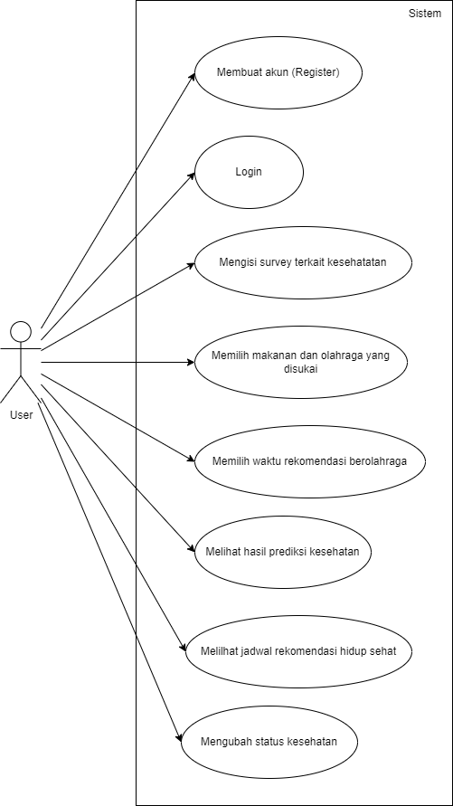
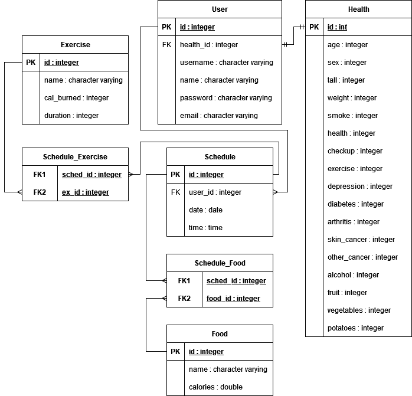
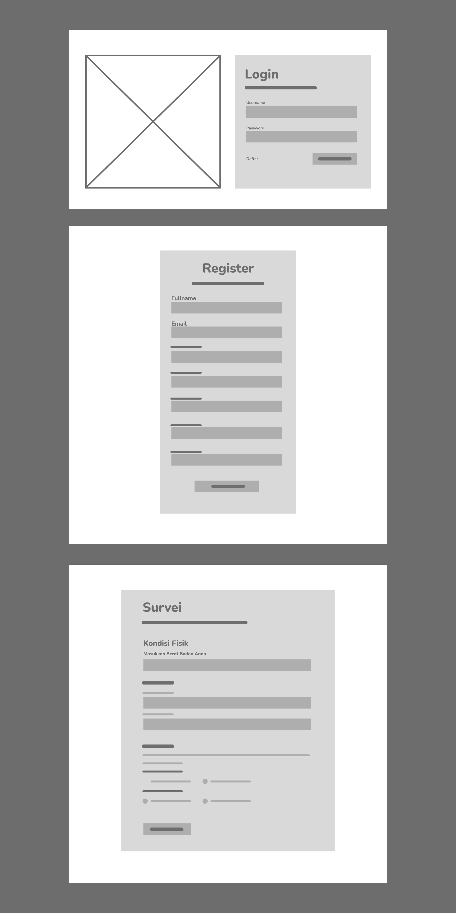
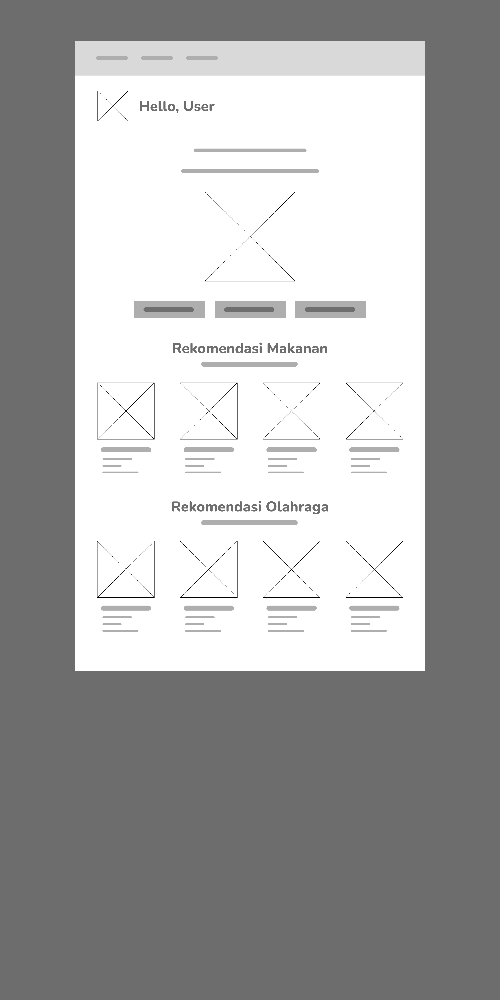
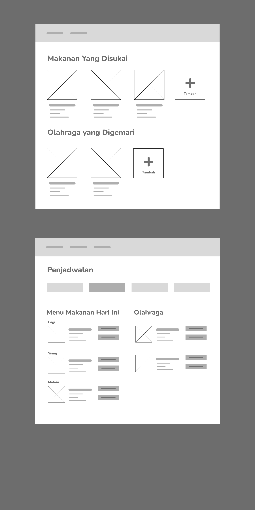
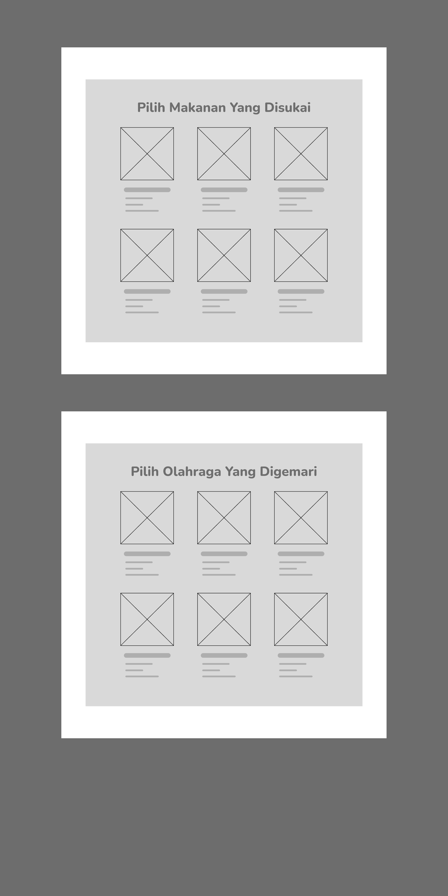
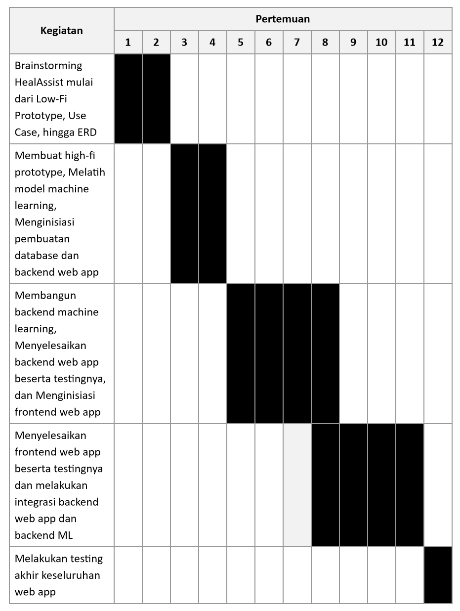

## Proyek Senior Project Teknologi Informasi
Departemen Teknik Elektro dan Teknologi Informasi, Fakultas Teknik, Universitas Gadjah Mada

## Kelompok SenproConqueror
- Anggota 1: Bagus Rakadyanto Oktavianto Putra - 21/474401/TK/52343
- Anggota 2: Fio Mel Nathany-21/473580/TK/52199
- Anggota 3: Gifto Ramadha - 21/480271/TK/52996

## HealAssist
Aplikasi untuk membantu deteksi dini penyakit cardiovascular dan mendukung pola hidup sehat berbasis AI
### Latar Belakang

 Penyakit jantung atau kardiovaskular masih menjadi salah satu penyebab kematian terbesar di dunia. Menurut WHO pada tahun 2019, lebih dari 17 juta orang meninggal akibat penyakit jantung dan pembuluh darah. Penyakit tersebut juga sering menyerang mereka di usia produktif, sehingga ada baiknya jika seseorang dapat mengetahui resiko terjangkit penyakit kardiovaskular sedini mungkin. Akan tetapi, mengunjungi dokter hanya untuk check-up dapat cukup merepotkan, sehingga perlu adanya opsi lain yang lebih sederhana. Selain itu, rekomendasi hidup sehat juga diperlukan untuk mengurangi resiko terjangkit penyakit kardiovaskular 

### Rumusan Permasalahan
1. Bagaimana pengguna dapat mengetahui resiko terjangkit penyakit cardiovascular secara terkini tanpa mengunjungi dokter?
2. Bagaimana pengguna dapat mengetahui rekomendasi hidup sehat yang sesuai dengan kondisi kesehatannya?
3. Apakah rekomendasi hidup sehat yang diberikan bisa disesuaikan dengan preferensi pengguna?

### Ide Solusi yang diusulkan

 Aplikasi ini pada umumnya akan memberikan personalized healthcare bagi pengguna. Pada aplikasi ini akan dirancang suatu antarmuka yang mudah dipahami pengguna. Aplikasi ini dapat menjadi pendamping gaya hidup sehat pengguna yang sesuai dengan keadaan kesehatan pengguna saat ini. Beberapa fitur utama dari aplikasi ini ialah memberikan prediksi resiko penyakit cardiovascular berbasis AI dan rekomendasi gaya hidup sehat sesuai resiko penyakit cardiovascular pengguna. Aplikasi ini nantinya akan meminta beberapa metrik kesehatan pengguna untuk mendapatkan keadaan kesehatan pengguna secara maksimal. Aplikasi ini juga mendukung pembaruan keadaan kesehatan agar pengguna dapat mengetahui apakah masih memiliki resiko penyakit cardiovascular atau tidak.

### Rancangan Fitur Utama
- Akun yang terpersonalisasi -> Pengguna dapat membuat akun sesuai keadaan kesehatannya
- Prediksi resiko penyakit cardiovascular -> Memanfaatkan teknologi ML yang telah dilatih untuk memprediksi resiko penyakit cardiovascular
- Rekomendasi makanan -> Demi mendukung gaya hidup sehat perangkat lunak akan memberikan rekomendasi porsi makanan sesuai hasil prediksi
- Rekomendasi olahraga -> Sama halnya seperti makanan perangkat lunak juga akan memberikan rekomendasi porsi olahraga sesuai hasil prediksi
- Penjadwalan otomatis -> Perangkat lunak juga akan melakukan penjadwalan otomatis makanan dan olahraga sesuai preferensi pengguna
- Pembaruan keadaan kesehatan -> Pengguna juga dapat melakukan pembaruan keadaan kesehatan sesuai dengan keadaan kesehatan terbaru dan mendapatkan prediksi resiko penyakit cardiovascular sesuai dengan keadaan terbarunya

### Analisis Kompetitor
**Kompetitor pertama**

<table>
    <thead>
        <tr>
            <th colspan=2>Kompetitor 1</th>
        </tr>
    </thead>
    <tbody>
        <tr>
            <td>Nama</td>
            <td>Halodoc</td>
        </tr>
        <tr>
            <td>Jenis Kompetitor</td>
            <td>[Tertiary Competitors]</td>
        </tr>
        <tr>
            <td>Jenis Produk</td>
            <td>Konsultasi Kesehatan Online</td>
        </tr>
        <tr>
            <td>Target Customer</td>
            <td>Seluruh Kalangan</td>
        </tr>
    </tbody>
    <thead>
        <tr>
            <th>Kelebihan</th>
            <th>Kekurangan</th>
        </tr>
    </thead>
    <tbody>
        <tr>
            <td>Menawarkan konsultasi dengan dokter asli secara online.</td>
            <td>Respon chat tidak instan atau masih harus menunggu</td>
        </tr>
        <tr>
            <td>Menawarkan akses produk kesehatan dan obat-obatan kepada pengguna secara online</td>
            <td rowspan=2>Sebagian layanan tidak beroperasi 24 jam</td>
        </tr>
        <tr>
            <td>Memiliki layanan untuk memanggil dokter datang ke rumah pasien</td>
        </tr>
    </tbody>
    <thead>
        <tr>
            <th colspan=2>Key Competitive Advantage & Unique Value</th>
        </tr>
    </thead>
    <tbody>
        <tr>
            <td colspan=2>
            Aplikasi Halodoc menawarkan sebuah interaksi layaknya orang dengan sebuah klinik pada umumnya, namun secara online. User dapat berkonsultasi tentang penyakit secara umum. Akan tetapi, pada aplikasi ini kurang terdapat informasi yang cukup detail tentang penyakit cardiovascular seperti yang aplikasi HealAssist tawarkan. 
            </td>
        </tr>
    </tbody>
</table>

**Kompetitor kedua**

<table>
    <thead>
        <tr>
            <th colspan=2>Kompetitor 2</th>
        </tr>
    </thead>
    <tbody>
        <tr>
            <td>Nama</td>
            <td>GUNS-R</td>
        </tr>
        <tr>
            <td>Jenis Kompetitor</td>
            <td>[Indirect Competitors]</td>
        </tr>
        <tr>
            <td>Jenis Produk</td>
            <td>Aplikasi untuk membantu asuhan gizi mandiri</td>
        </tr>
        <tr>
            <td>Target Customer</td>
            <td>Remaja</td>
        </tr>
    </tbody>
    <thead>
        <tr>
            <th>Kelebihan</th>
            <th>Kekurangan</th>
        </tr>
    </thead>
    <tbody>
        <tr>
            <td>Dapat mendiagnosa kondisi kesehatan user berdasarkan informasi </td>
            <td rowspan=2>Informasi kurang lengkap dalam menampilkan suatu diagnosa</td>
        </tr>
        <tr>
            <td>Memiliki monitoring untuk evaluasi sehingga dapat mengontrol user</td>
        </tr>
    </tbody>
    <thead>
        <tr>
            <th colspan=2>Key Competitive Advantage & Unique Value</th>
        </tr>
    </thead>
    <tbody>
        <tr>
            <td colspan=2>
            Aplikasi ini berfokus pada gizi untuk user dan dapat memonitor kondisi gizi user secara umum, serta memberikan rekomendasi aktivitas dan makanan yang cocok untuk melakukan diet
            </td>
        </tr>
    </tbody>
</table>

**Kompetitor ketiga**

<table>
    <thead>
        <tr>
            <th colspan=2>Kompetitor 3</th>
        </tr>
    </thead>
    <tbody>
        <tr>
            <td>Nama</td>
            <td>Lekasehat</td>
        </tr>
        <tr>
            <td>Jenis Kompetitor</td>
            <td>[Tertiary Competitors]</td>
        </tr>
        <tr>
            <td>Jenis Produk</td>
            <td>Konsultasi Kesehatan Online</td>
        </tr>
        <tr>
            <td>Target Customer</td>
            <td>Remaja</td>
        </tr>
    </tbody>
    <thead>
        <tr>
            <th>Kelebihan</th>
            <th>Kekurangan</th>
        </tr>
    </thead>
    <tbody>
        <tr>
            <td rowspan=2>Memiliki layanan chat dan video call dokter 24 jam dan responsif</td>
            <td>Layanan mengenai obat tidak bisa secara online</td>
        </tr>
        <tr>
            <td>Semua jenis layanan berbayar</td>
        </tr>
    </tbody>
    <thead>
        <tr>
            <th colspan=2>Key Competitive Advantage & Unique Value</th>
        </tr>
    </thead>
    <tbody>
        <tr>
            <td colspan=2>
            Yang ditonjolkan pada aplikasi ini yaitu kecepatan layanan dan respon 24 jam nonstop. Namun aplikasi tidak menyajikan informasi mengenai macam-macam penyakit dan gaya hidup sehat.
            </td>
        </tr>
    </tbody>
</table>

### Metodologi SDLC

 Kami menggunakan metodologi SDLC sederhana yaitu Kanban. Alasan kami menggunakan metode Kanban ini karena sesuai dengan profil developer yang mengerjakan tugas ini. Kanban merupakan metodologi SDLC yang cenderung lebih santai daripada Scrum tetapi progres dari pengerjaan tetap dapat di-track melalui metode kanban yang ada. Kami juga akan memanfaatkan projects management yang ada di github dan pada github tersebut juga menggunakan metode kanban untuk metodologi SDLC yang ada. 

### Perancangan Tahap 1-3 SDLC
**Tujuan dari Produk**

  Membantu user untuk menjaga pola hidup sehat dan mencegah penyakit, khususnya penyakit cardiovascular 

**Pengguna potensial dari Produk**

 Aplikasi HealAssist ditujukan kepada empat jenis pengguna:

- Orang yang ingin berusaha selalu hidup sehat dan memiliki awareness terhadap penyakit kardiovaskular
- Seorang individu dengan risiko Kardiovaskular tinggi
- Seorang pasien yang sedang dalam proses pemulihan
- Kelompok usia lanjut

 Keempat jenis pengguna tersebut memiliki satu kebutuhan yang sama, yaitu kebutuhan untuk menjaga kondisi fisik agar tetap sehat.

**Use case diagram**

**Functional Requirements**
- Membuat akun (Register) -> Calon pengguna dapat membuat akun pada aplikasi untuk dapat mengakses fitur-fitur yang ada
- Login -> Pengguna dapat masuk ke aplikasi menggunakan akun yang telah dibuat
- Mengisi survey terkait kesehatan -> Pengguna harus mengisi survey terkait kesehatan mereka. Hasil survey akan digunakan untuk menentukan rekomendasi hidup sehat
- Memilih makanan dan olahraga yang disukai -> Pengguna dapat memilih makanan dan olahraga yang akan dimasukkan pada jadwal rekomendasi hidup sehat
- Memilih waktu rekomendasi berolahraga -> Pengguna dapat memilih waktu olahraga yang akan dimasukkan dalam jadwal rekomendasi hidup sehat
- Melihat hasil prediksi kesehatan -> Berdasarkan survey kesehatan yang telah diisi, pengguna dapat melihat prediksi kesehatan mereka
- Melihat jadwal rekomendasi hidup sehat -> Pengguna dapat melihat jadwal makanan yang perlu dikonsumsi dan olahraga yang perlu dilakukan untuk menjaga hidup sehat
- Mengubah status kesehatan -> Jika ada perubahan dalam kondisi kesehatan, pengguna dapat mengubah status kesehatan yang telah diisi saat survey

**Entity Relationship Diagram**

**Low-Fi Wireframe**

**Gantt-Chart pengerjaan proyek dalam kurun waktu 1 semester**
